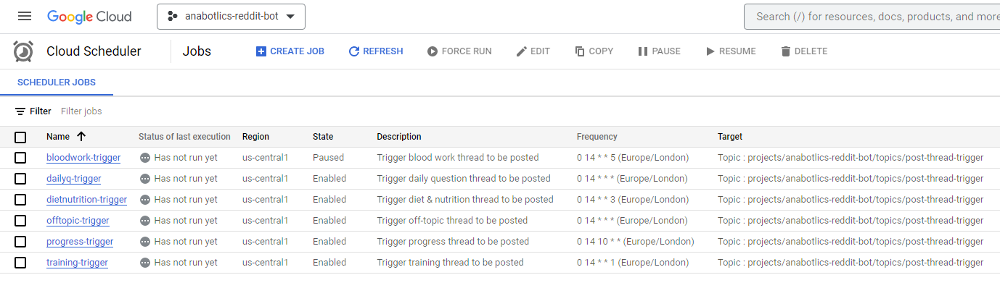
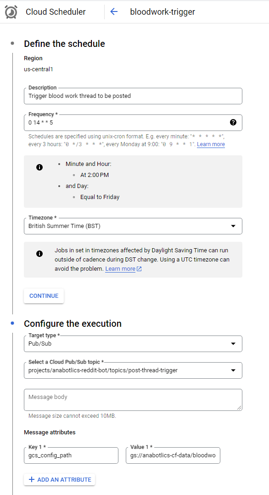
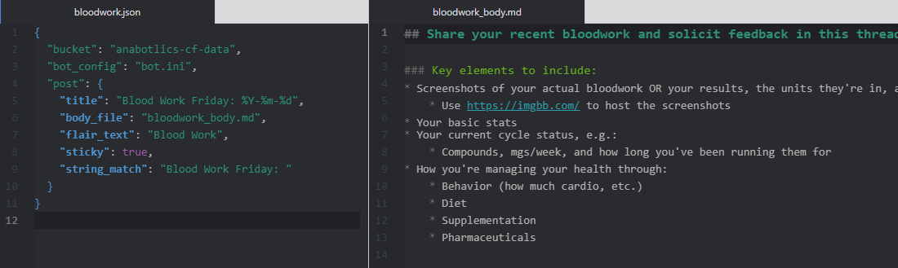
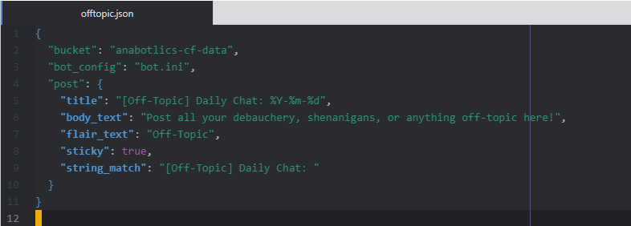
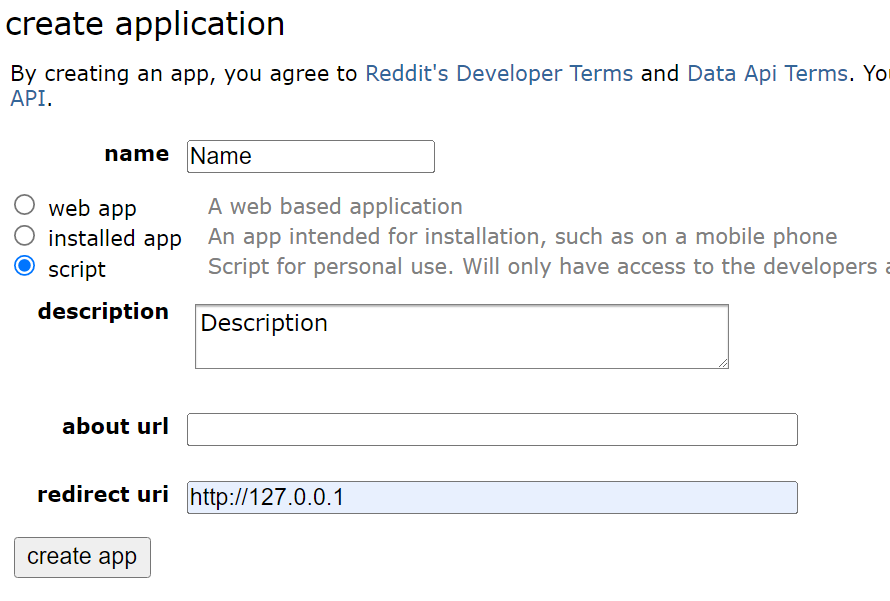
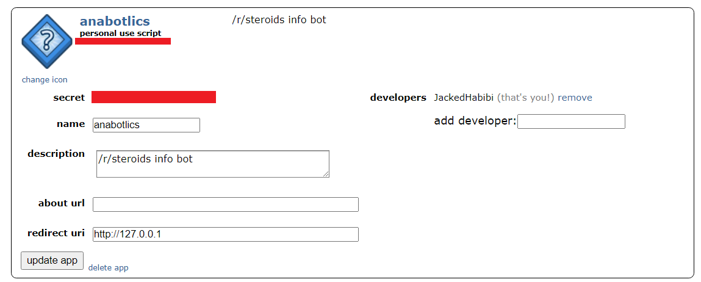

# Anabotlics  - A natty bot for geared monkeys

This describes how Anabotlics behaves and how to add threads to be posted at set intervals

## How it works

Anabotlics is a simple python Reddit bot that uses PRAW

The bot listens to a specific topic of a messaging service and is triggered when any new event is added to the topic

For each kind of thread that needs to be posted at specific intervals, a trigger is created to send an event on the topic the bot listens to.

The trigger specifies the frequency the event needs to be fired (e.g. "Every Friday at 2pm", "The 10th of every month"), and where to find the config file that contains all the necessary details to post the thread.

1. The bot listens to messages being added to the `post-thread-trigger` topic

2. A scheduled trigger sends a message on the topic with a path to the config file

3. The bot receives the message, reads the config file, and post a thread accordingly

### Triggers

Below you can see the current triggers created for the various repeated posts



#### Example

This is an example of a trigger



#### How to add a trigger

The three main things to understand if you need to add a trigger:

- Frequency: cron string defines when to trigger this event (if you are unsure how to read that you can use https://crontab.guru but Google also shows the definition in the box below the frequency)

- Cloud Pub/Sub topic: this is the topic the bot listens to, do not change it without changing the topic the bot listens to, it should stay as is for any new Triggers

- Message attributes: For the bot to know what to post, we add in the event the location of where to find the thread details. This attribute needs to be named `gcs_config_path` and point to an existing file within Google Cloud Storage

### Thread Config

A thread config is a JSON file that provides all the necessary information for the bot to post the thread


#### Definition

```json
{
  "bucket": "Google Cloud Storage bucket that contains the .ini and .md files",
  "bot_config": "Name of the .ini files containing the bot_config. This must be in the bucket specified above",
  "post": {
    "title": "Title of the post to be posted",

    # One or the other
    "body_text": "Raw text to be posted as the body of the thread",
    "body_file": "Path to a .md file to be posted as the body of the thread",

    # Optional
    "flair_text": "If post must be flaired, this is the text of the flair to use",
    "sticky": true if post must be stickied otherwise do not include,
    "string_match": "If sticky is true this is used to find the previous post to unsticky"
  }
}
```

#### Example



#### Additional info

##### Title

You can specify a date format to add in the title by using python datetime format string, this is expressed with a '%' symbol followed by the correct letter code

You can find a [cheatsheet here](https://strftime.org/)

For example, `%Y-%m-%d` will be translated as `2023-12-31`

`%B %Y` translates to `December 2023`

##### Flair Text

This is case insensitive, as long as the text matches a flair text of the subreddit, the post will be properly flaired

##### Bot Config

This will almost always be `bot.ini` (assuming the file in the bucket is `bot.ini`)

The structure of the `bot.ini` file must be

```ini
[DEFAULT]
CLIENT_SECRET:
CLIENT_ID:
PASSWORD:
USERNAME: Anabotlics
USER_AGENT: Anabotlics by /u/JackedHabibi
SUBREDDIT: steroids
```

This file should not be touched, downloaded, or shared, as it contains sensitive information required for the bot to authenticate itself.


##### Body Text / File

Only one is required, `body_text` is good to be used when the body of the post is relatively small and doesn't contain markdown as it will save the bot having to read the file from storage

Here is an example of a thread config that does not use `body_file`



### FAQ

#### How to add a new post to be posted ?

1. Create `{THREAD_NAME}.json` with the thread config and add it to the default bucket

2. Optionally create `{THREAD_NAME}_body.md` with the text of the thread if it's markdown

3. Create a trigger in Google Cloud Scheduler


#### How to modify the title or text of a scheduled thread ?

1. Modify the `{THREAD_NAME}.json` to change the title and body text

2. Optionally modify the `{THREAD_NAME}_body.md` to change the text of the body if it's in a markdown file

#### How to change the frequency of a scheduled thread ?

Change the cron string of the trigger in Google Cloud Scheduler

#### How to change the subreddit the bot posts to ?

Change the subreddit

#### How to change the bot credentials ?

Change the `USERNAME` and `PASSWORD` values in `bot.ini`

The user matching those credentials must be a developer of the Reddit Application defined by `CLIENT_SECRET` and `CLIENT_ID`

#### How to add a developer to the Reddit Application ?

Adding a developer to the reddit app allows the developer account to post on the behalf of the bot and use the API with the app's id and secret (you still need to supply the user's own username and password to be able to submit posts and comments)

1. Go to https://www.reddit.com/prefs/apps

2. Navigate to the Reddit Application

3. Click `Edit`

4. In the input `add developer` add the username

5. Click `update app`

#### The Reddit Application was banned for spam, how to change the application used by the bot ?

The bot may get banned automatically if it is deemed too spammy, you can circumvent that by simply creating a new Reddit App and passing its secret and id to the bot

1. Go to https://www.reddit.com/prefs/apps

2. Click `create another app...`

3. Select `script`

4. Give it a name and description

5. In `redirect uri` input `http://127.0.0.1`

6. Click `create app`



7. Note the app id shown below the name you set, right below `personal use script` and app secret



8. Update the `bot.ini` and change the `CLIENT_ID` and `CLIENT_SECRET` with the new values you just got
